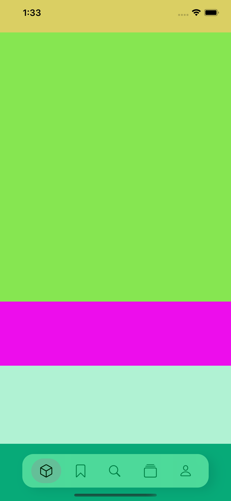
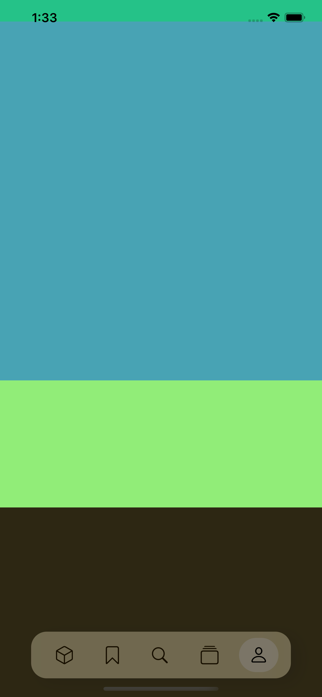

<h1 align="center">FloatingTabBar</h1>

<strong>made by <a href="https://github.com/claudiaeng">claudiaeng</a></strong>

An aesthetic floating tab bar importabable via Swift Package Manager. Based off <a href ="https://github.com/smartvipere75/bottombar-swiftui">BottomBar-SwiftUI</a>

## Previews

|  |  |  |
|--|--|--|
|  |  | |

## To-do
- [ ] Dark mode adjsutments
